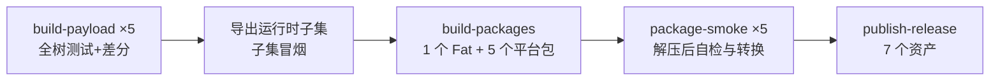

# 打包拆分与瘦身方案：Fat 包 + 各平台独立包（供实现模型执行）

日期：2026-09-23。基线：`main` @ `263f657`。状态：待实施。

本文给出可执行的改造规格：
- 把一个 Fat Plugin 拆成"全平台 Fat 包 + 每个平台一个独立包"；
- 在不改变转换算法和官方数据的前提下缩小体积；
- 增加 Linux ARM64；
- 说明 Windows ARM64 目前受阻的原因与可选路线。

每个条目给出位置、要求、约束和验证方法，写法与同目录的 `01-ui-logic-spec.md` 一致。测量脚本在 `scripts/packaging/`，见附录。

---

## 0. 实现者必读

必须同时载入 `docs/OpenCCForSigil_Spec_v1.4/INVARIANTS.md`、`docs/release.md`、`docs/native-backend.md`、`docs/jieba-native-evaluation.md`。与本次最相关的不变量：

| 编号 | 内容摘要 | 本次风险点 |
| --- | --- | --- |
| 4 | 运行时不得下载、pip、联网 | 平台包不得"缺了再下载" |
| 5 | 只加载 manifest 批准的、解压的官方 wheel payload；不得写入字节码缓存 | P-01 运行时子集、P-11 共享数据都需要规格补充说明 |
| 7 | Python 实现/版本/ABI/OS/架构精确匹配 | P-03 新增 `linux/aarch64`；P-06 架构不匹配提示 |
| 8 | import origin 必须位于所选 payload | P-11 共享数据不能移动 Python 模块 |
| 9、10 | provenance 冻结；Binding/Core/configs/dicts 同一 release | P-00 Windows 数据被改写；P-01 派生树记录 |
| 11 | Binding 与官方 CLI 逐码点一致 | P-01 删 CLI 后，差分测试的 CLI 来源 |
| 14 | 官方 configs/dictionaries 只读 | P-00 CRLF 改写；P-11 不得修改官方配置文件 |
| 15 | Jieba 仅在已验证时可用，失败即关闭 | 所有平台包都要带同样的 Jieba 能力 |

**需要用户决策、未经批准不得实施的事项**：
- P-11 共享数据：需要修订规格；
- 第 7 节 Windows ARM64 的 B2 路线：自行从官方 sdist 构建 wheel，与不变量 5 冲突；
- 第 8 节 Linux 多 Python 版本：与不变量 6/7 冲突。

实现者遇到这些事项时停下，在交付说明中列出，不要自行决定。

---

## 1. 结论

**体积**：v0.1.0 Fat 包实测 33.03 MB，含 4 个平台（从 GitHub Release 下载后分析）。每个平台约 7.3–8.9 MB，其中：
- Jieba 词典数据约 6 MB（macOS/Linux），占 70% 以上；
- 运行时用不到的 CLI 工具、静态库、头文件、CMake 与 pkgconfig 文件合计约 1.1–2.1 MB；
- 只在 `jieba_merged.ocd2` 缺失时才会用到的文本词典约 1.9 MB。

**瘦身效果估算**（压缩后）：
- 第一阶段只保留运行时需要的文件后，单平台包约 5.0–5.8 MB；5 平台 Fat 包约 27 MB。不瘦身的话，5 平台约 42 MB。
- 第三阶段（需批准）让 Fat 包内平台无关的数据只存一份，5 平台 Fat 包约 8 MB。

**平台**：
- Linux ARM64 可行：PyPI 上有官方 `opencc-1.4.2-cp314-cp314-manylinux2014_aarch64` wheel，仓库是公开仓库，可以用 GitHub 托管的 ARM64 runner。
- Windows ARM64 目前受阻：OpenCC 在 PyPI 上的所有版本都没有 `win_arm64` wheel（最新版为 1.4.2）。

**顺带发现的已发布缺陷**（P-00，优先修）：v0.1.0 的 Windows payload 缺少 `jieba_merged.ocd2`，Jieba 词典与模型文件全部被改成了 CRLF 换行。Windows 上的 Jieba 实际走的是上游的"文本词典回退"路径，数据字节也与上游不同。现有差分测试在同一棵 Windows 数据树上比较 Binding 与 CLI，发现不了这个问题。

---

## 2. 现状测量

### 2.1 v0.1.0 Fat 包构成（压缩后 MB）

数据来自 `OpenCCForSigil_0.1.0.zip`（GitHub Release 资产，33,027,451 字节）逐成员统计。

| payload | CLI 工具 `bin/` | 静态库/头文件/CMake/pc | Jieba 数据 | 其余（原生库、标准词典、配置、Python） | 合计 |
| --- | --- | --- | --- | --- | --- |
| linux-x86_64 | 0.75 | 0.65 | 6.05 | 1.48 | 8.93 |
| macos-arm64 | 0.58 | 0.54 | 6.05 | 1.05 | 8.22 |
| macos-x86_64 | 0.63 | 0.55 | 6.05 | 1.10 | 8.33 |
| windows-x86_64 | 0.61 | 1.50 | 4.29 | 0.90 | 7.30 |
| 插件代码与资源 | — | — | — | — | 0.14 |

Jieba 数据逐文件（macOS arm64，压缩后）：

| 文件 | 压缩后 | 运行时是否需要 |
| --- | --- | --- |
| `jieba_merged.ocd2` | 1.73 MB | 需要：配置中的 `dict_path` |
| `idf.utf8` | 2.11 MB | 需要：插件检查可读，否则拒绝加载 |
| `jieba.dict.utf8` | 1.90 MB | 不需要：仅当 `jieba_merged.ocd2` 不可读时回退使用 |
| `hmm_model.utf8` | 0.20 MB | 需要：配置中的 `model_path` |
| `stop_words.utf8` | <0.01 MB | 需要：插件检查可读 |
| `user.dict.utf8` | <0.01 MB | 不需要：已并入 merged，仅在回退时使用 |

"是否需要"依据上游固定提交 `025f371dc76b598d77384fbdab90c937471844d8` 的源码：
- `plugins/jieba/src/JiebaSegmentationPlugin.cpp`：`CreateJiebaSegmentation` 要求 `dict_path`、`model_path`、`idf.utf8`、`stop_words.utf8` 可读；`FallbackToTextJiebaDictionaries` 只在 merged 不可读时改用 `jieba.dict.utf8` 和 `user.dict.utf8`。
- `plugins/jieba/CMakeLists.txt:219-229`：merged 由 `jieba.dict.utf8` 与 `user.dict.utf8` 生成。

### 2.2 官方 wheel 数据是否跨平台一致

下载 5 个官方 cp314 wheel（sha256 与 PyPI 一致）比较 `opencc/clib/share/opencc/` 下的 38 个文件：
- 所有 `.ocd2` 词典在 5 个 wheel 中字节完全相同；
- macOS arm64、macOS x86_64、Linux x86_64、Linux aarch64 的全部 38 个文件完全相同；
- Windows wheel 有 16 个 `.json` 配置不同，差异只是 CRLF 换行，JSON 语义相同。

### 2.3 v0.1.0 已发布 payload 的 Jieba 数据

| payload | 有 `jieba_merged.ocd2` | 文本文件换行 |
| --- | --- | --- |
| linux-x86_64、macos-arm64、macos-x86_64 | 有，三者字节相同 | LF，三者字节相同 |
| windows-x86_64 | **没有** | **CRLF**（5 个文本文件全部如此，去掉 `\r` 后与其他平台相同） |

### 2.4 PyPI 可用 wheel（OpenCC 1.4.2，cp314）

| 平台 | wheel | 状态 |
| --- | --- | --- |
| Linux x86_64 | `manylinux2014_x86_64` | 已在 lock 中 |
| Linux aarch64 | `manylinux2014_aarch64`，2,408,987 字节，sha256 `050bdc8516b4830be810504dfed1e5d6ac8ca81f19030b7c187abec5160683ca` | 未使用，可新增 |
| macOS arm64 / x86_64 | `macosx_11_0_arm64` / `macosx_10_15_x86_64` | 已在 lock 中 |
| Windows x86_64 | `win_amd64` | 已在 lock 中 |
| Windows ARM64 | 无；PyPI 上 OpenCC 任何版本都没有 `win_arm64` | 受阻 |

Linux aarch64 wheel 的 URL：`https://files.pythonhosted.org/packages/03/a6/45a09a6f0344cca2d645254ee9494684733ecdf1c7faf3135577430a4d8c/opencc-1.4.2-cp314-cp314-manylinux2014_aarch64.manylinux_2_17_aarch64.whl`。实现时必须用 `tools/fetch_opencc_wheels.py` 的现有流程重新核对 PyPI 元数据，不得直接抄本文数值入库。

---

## 3. 目标产物

| 资产名 | 内容 | oslist |
| --- | --- | --- |
| `OpenCCForSigil_<版本>.zip` | Fat 包，全部受支持平台 | `osx,unx,win` |
| `OpenCCForSigil_<版本>_macos-arm64.zip` | 仅 macOS Apple Silicon | `osx` |
| `OpenCCForSigil_<版本>_macos-x86_64.zip` | 仅 macOS Intel（含 Rosetta 下运行的 Sigil） | `osx` |
| `OpenCCForSigil_<版本>_windows-x86_64.zip` | 仅 Windows x64 | `win` |
| `OpenCCForSigil_<版本>_linux-x86_64.zip` | 仅 Linux x86_64 | `unx` |
| `OpenCCForSigil_<版本>_linux-aarch64.zip` | 仅 Linux ARM64 | `unx` |
| `SHA256SUMS.txt` | 以上所有 ZIP 的 SHA-256 | — |

规则：

1. Fat 包保留现有文件名，与已发布版本和现有 `tests/unit/test_release_assets.py` 保持兼容。
2. 所有 ZIP 的唯一顶层目录都是 `OpenCCForSigil/`，这样 Fat 包与平台包可以互相覆盖安装。用户数据在插件目录之外，不受影响。
3. 平台包的 `plugin.xml` 在打包时生成对应的 `oslist`，不修改源码树里的 `plugin.xml`。Sigil 安装时是否校验 `oslist` 需要宿主实测；无论结果如何，运行时都有 P-06 的架构检查兜底。
4. 包内 `vendor/opencc/manifest.json` 只列出该包包含的 payload，并新增 `package` 字段：`{"flavor": "fat"|"platform", "runtimes": [...], "asset_name": "..."}`。

---

## 4. 第一阶段：只打包运行时需要的文件

### P-00 修复 Windows payload 的 Jieba 数据（P0，已发布缺陷）

**位置**
- `.github/workflows/ci.yml:57-64`：在 Windows runner 上 checkout BYVoid/OpenCC，git 默认 autocrlf 会把文本文件改成 CRLF。
- 上游 `plugins/jieba/CMakeLists.txt:130-132`：检测到 Visual Studio 生成器（`CMAKE_VS_PLATFORM_NAME` 非空）时设置 `OPENCC_CAN_RUN_CPPJIEBA_DICT FALSE`，不生成 merged 词典。
- `tools/build_opencc_jieba.py:369-378`：把安装目录里的 `jieba_dict` 原样复制进 payload，缺文件也不报错。

**修改要求**

1. checkout 上游源码之前，在所有 runner 上执行 `git config --global core.autocrlf false`（写成单独的 workflow step，放在第 57 行那个 checkout 之前）。
2. Windows 的 Jieba 构建改用 Ninja 生成器配合 MSVC 工具链。
   - 做法：在 `tools/build_opencc_jieba.py:270-283` 的 configure 命令中，Windows 分支加 `-G Ninja`；workflow 中先用 `ilammy/msvc-dev-cmd` 设置 MSVC 环境。
   - 原因：目前没有指定 `-G`，Windows 默认使用 Visual Studio 生成器，因此 `CMAKE_VS_PLATFORM_NAME` 被设置，上游跳过了 merged 词典的生成。
   - 脚本 `:303-306` 的注释表明原意就是在 Windows 上调用 wheel 自带的 `opencc_dict.exe` 生成 merged 词典，只是被上游条件静默跳过了。
   - 独立插件构建模式下，merged 词典由同一 release wheel 的 `opencc_dict` 生成（上游 `CMakeLists.txt:152-156` 的 `find_program`），来源一致。
   - 不要用自写脚本替代上游的 merged 生成步骤；
   - 如果 Ninja 方案不可行，停下报告，不要回退到文本词典。
3. `build_opencc_jieba.py` 复制完成后做两项硬检查，任一失败即中止：
   - `jieba_dict/jieba_merged.ocd2` 必须存在；
   - 所有 `.utf8` 文件不得包含 `\r\n`。
4. `payload-lock.json` 新增 `jieba_resources` 表：记录 `jieba_merged.ocd2`、`hmm_model.utf8`、`idf.utf8`、`stop_words.utf8` 的期望 sha256，取值为当前 Linux/macOS 的实际值（见 manifest 中的 `resource_hashes`）。每个平台构建后必须与之完全一致。
5. `tools/merge_verified_payloads.py` 增加跨 payload 校验：所有 payload 的 Jieba 资源 hash 必须两两相同，否则中止。

**验证**
- 单元测试：`build_opencc_jieba` 的复制函数在缺 merged、含 CRLF 时各自抛出明确错误。
- `merge_verified_payloads` 在两个 payload 的 `idf.utf8` hash 不同时失败。
- CI：Windows 构建日志显示 merged 已生成；最终 ZIP 中 Windows 的 `jieba_merged.ocd2` hash 等于 Linux/macOS。
- 跨平台输出一致性（新增）：每个 native job 把 `differential_jieba_test.py` 的逐条输出写成 JSON 并上传。打包 job 断言所有平台的输出逐条相同。这一条专门用来发现"同一平台内 Binding=CLI、但平台之间不一致"的问题。

---

### P-01 运行时子集导出（P1）

**位置**：`tools/export_verified_payload.py`（导出已在目标平台测试过的 payload），以及 `tools/merge_verified_payloads.py`、`tools/verify_vendor.py`、`tools/validate_artifact.py`。

**修改要求**

1. native job 仍在完整解压的 wheel 树上执行现有全部测试与差分，CLI 来自完整树。之后才导出运行时子集。
2. 子集用**白名单**定义，写成单独的纯函数模块 `tools/runtime_subset.py`，构建工具与校验器共用。不在白名单里的文件一律报错，不静默丢弃，这样升级 OpenCC 时新增文件会被强制审查。白名单：

   ```text
   opencc/__init__.py
   opencc/cli.py
   opencc/py.typed
   opencc/clib/__init__.py
   opencc/clib/opencc_clib*.so | opencc/clib/opencc_clib*.pyd
   opencc.libs/**                          # Windows delvewheel 运行库，如 msvcp140-*.dll，必须保留
   opencc/clib/share/opencc/*.json
   opencc/clib/share/opencc/*.ocd2
   opencc/clib/share/opencc/jieba_dict/jieba_merged.ocd2
   opencc/clib/share/opencc/jieba_dict/hmm_model.utf8
   opencc/clib/share/opencc/jieba_dict/idf.utf8
   opencc/clib/share/opencc/jieba_dict/stop_words.utf8
   <manifest native_plugins.plugin_dir>/<library 文件名>
   opencc-1.4.2.dist-info/{METADATA,WHEEL,RECORD,top_level.txt,entry_points.txt}
   opencc-1.4.2.dist-info/licenses/**
   ```

   明确排除：
   - `opencc/clib/bin/**`；
   - `opencc/clib/lib/**` 和 `opencc/clib/lib64/**`（插件目录除外；Linux wheel 的静态库在 `lib64/` 下）；
   - `opencc/clib/include/**`；
   - `*.a`、`*.lib`、`**/cmake/**`、`**/pkgconfig/**`；
   - `jieba_dict/jieba.dict.utf8`、`jieba_dict/user.dict.utf8`。
3. manifest 每个 payload 新增 `derivation` 字段：

   ```json
   {
     "recipe": "runtime-subset-v1",
     "source_wheel_sha256": "<与 wheel_sha256 相同>",
     "source_tree_sha256": "<完整解压树的 tree hash>",
     "removed": [{"path": "...", "sha256": "...", "size": 0}]
   }
   ```

   `payload_sha256` 改为子集树的 hash。`config_data.files`、`native_plugins.*.resource_hashes` 去掉被删文件，并重算 `resource_manifest_sha256`。
4. `RECORD` 保留原样，它描述的是原始 wheel。在 manifest 中注明 `record_describes: "source_wheel"`，校验器不得拿 `RECORD` 去比对子集树。
5. 运行时代码（`opencc_backend/*`）不需要改：`verify_tree_sha256` 校验的就是实际发布的文件。需要全仓搜索确认插件运行时不引用 `bin/`、`include/` 或静态库。
6. 在 `docs/OpenCCForSigil_Spec_v1.4/REVISION_NOTES.md` 增补一条"官方 wheel 的运行时子集"：
   - 允许排除的类别（开发与 CLI 文件，以及 merged 已覆盖的文本词典）；
   - 派生记录要求；
   - 声明不改变算法、配置或词典内容。
   这是对不变量 5 的澄清，不是放宽。

**约束**
- 不得删除 `opencc.libs/`：Windows 的 pyd 依赖其中的 `msvcp140-a4c2229bdc2a2a630acdc095b4d86008.dll`（已从 pyd 导入表确认）。
- 不得删除 `idf.utf8` 与 `stop_words.utf8`（插件会检查可读）。
- 不得修改保留文件的任何字节。

**验证（自动化）**
- `tests/unit/test_runtime_subset.py`：
  - 用假目录树验证白名单结果；
  - 出现未知文件时报错；
  - Linux 的 `lib64/` 静态库被排除；
  - Windows 的 `opencc.libs/*.dll` 被保留；
  - 两次运行得到相同的子集 hash。
- `tests/unit/test_artifact_validator.py`：payload 内出现 `bin/opencc`、`*.a`、`include/`、`jieba.dict.utf8` 中任一项时，校验失败。
- `tests/unit/test_payload_integrity.py`：由 `derivation.removed` 与子集能重建出 `source_tree_sha256`（在有完整树的 native job 中执行）。

**验证（CI，每个 native job）**
1. 在导出的子集树上，用干净进程执行：`RuntimeSelector().import_opencc()`、`OpenCCBackend(...).self_test(include_optional=True)`，16 个标准配置和 7 个 Jieba 配置各转换一句。
2. 标准差分与 Jieba 差分语料：Binding 使用子集树，CLI 使用完整树的 `bin/opencc`，要求 100% 一致。这一步证明删文件没有改变输出。
3. 记录子集压缩后大小，写入 job summary。

---

### P-02 体积预算闸（P2）

**修改要求**：`tools/validate_artifact.py` 增加按包类型的上限，超过即失败：
- 平台包 ≤ 7.0 MB；
- 第一阶段 Fat 包 ≤ 30 MB；
- 第三阶段实施后 Fat 包 ≤ 12 MB。

上限写成常量，并在 `docs/release.md` 说明调整上限需要人工评审。

**验证**：构造超限 ZIP 时校验失败；正常包通过。

---

## 5. 第二阶段：平台独立包与 Linux ARM64

### P-03 新增 `linux-aarch64` 运行时身份（P1）

**位置**：
- `tools/runtime_matrix.py:16-21` 的 `SUPPORTED_RUNTIME_IDENTITIES`；
- `native_build/payload-lock.json`；
- `plugin/OpenCCForSigil/vendor/opencc/manifest.json`（由构建工具生成）。

**修改要求**
1. 新增身份 `("CPython", "3.14", "cp314", "linux", "aarch64")`，payload 目录 `payloads/linux-aarch64-cp314`。
2. 架构字符串以运行时实际检测结果为准：
   - `runtime_selector._normalize_architecture`（`runtime_selector.py:229-235`）在 Linux 上返回 `aarch64`，在 macOS 上返回 `arm64`；
   - Windows ARM64 上 `platform.machine()` 为 `ARM64`，会被归一为 `arm64`；
   - manifest、lock、runtime_matrix 必须使用同样的字符串。
   - `tools/native_compatibility.py:31-50` 已把 `aarch64` 别名为 `arm64` 并支持 ELF 机器号 183，只需补测试。
3. lock 中新增 aarch64 wheel 条目（见 2.4），通过 `tools/fetch_opencc_wheels.py` 与 PyPI 实时元数据核对。

**验证**
- 单元测试：模拟 `sys.platform="linux"`、`platform.machine()="aarch64"` 时选中 `linux-aarch64-cp314`；模拟 `aarch64` 的 ELF 头通过 `native_compatibility` 检查。
- `--require-runtimes` 要求 5 个身份。

---

### P-04 CI 新增 Linux ARM64 native job（P1）

**位置**：`.github/workflows/ci.yml:21-29` 的 matrix。

**修改要求**
1. 新增 `- id: linux-aarch64` / `runner: ubuntu-22.04-arm`。仓库为公开仓库，可以使用 GitHub 托管的 ARM64 Linux runner；实施时在一次 `workflow_dispatch` 中确认 runner 可用。
2. 沿用 Ubuntu 22.04 + GCC 11，使 Jieba 库的 GLIBC ≤ 2.35、GLIBCXX ≤ 3.4.30（与 x86_64 相同的闸）。
3. `Inspect Linux native plugin linkage` 步骤基于 `runner.os == 'Linux'`，会自动覆盖 ARM64，确认输出正常即可。
4. 缓存 key 已含 `matrix.id`，无需额外修改。确认 mise、uv 和 Python 3.14.7 在 ARM64 上可安装。

**验证**：ARM64 job 通过全部现有步骤（vendor、Jieba 构建、verify_vendor、pytest、两套差分、导出），并产出 `opencc-payload-linux-aarch64` artifact。

---

### P-05 构建与校验支持两种包类型（P1）

**位置**：`tools/build_plugin.py:35-119`、`tools/validate_artifact.py:512-560`、`tools/verify_vendor.py`。

**修改要求**
1. `build_plugin.py` 新增参数：`--flavor fat|platform` 与 `--runtime <payload-id>`（platform 必填）。
   - `fat` 包含 manifest 中全部 payload（配合 `--require-runtimes` 要求完整集合）；
   - `platform` 只打入一个 payload。
   - 默认输出名见第 3 节。
2. 打包时在 ZIP 内生成：
   - 过滤后的 `manifest.json`（只含所选 payload，加上 `package` 字段）；
   - 替换 `oslist` 的 `plugin.xml`；
   - 源码树文件保持不变。
   写入顺序、时间戳和权限沿用现有的确定性规则（`build_plugin.py:81-94`）。
3. `validate_artifact.py`：
   - 新增 `--flavor platform --runtime <id>`：要求 manifest 恰好含该 payload、ZIP 中不存在其他 payload 目录、`oslist` 与平台相符、`package.flavor == "platform"`；
   - `--require-runtimes` 保留为 Fat 包的全集要求；
   - 两种模式都执行现有的 hash、notice、i18n、资源检查和 P-01、P-02 的检查。
4. `verify_vendor.py` 保持对源码树的校验，不感知包类型。

**验证（自动化）**
- `tests/integration/test_package.py` 参数化两种类型：同一源码树连续构建两次，字节完全相同；platform 包内只有一个 payload 目录；manifest 的 `payloads` 长度为 1；`oslist` 正确。
- `tests/unit/test_artifact_validator.py`：platform 包中混入第二个 payload、`oslist` 写错、`package.flavor` 与参数不符时，各自失败。

---

### P-06 装错平台包时给出明确提示（P1）

**位置**：`opencc_backend/manifest.py:232-254`（`select` 的错误文案）、`app/controller.py` 的预检，以及已实现的错误对话框（L-11）。

**现状**：`RuntimeSelectionError` 的英文文案统一建议"切回 Bundled Python"。装错架构的平台包（例如 Apple Silicon 上装了 x86_64 包）时，这个提示是错的。

**修改要求**
1. `RuntimeSelectionError` 增加结构化字段：`detected`（实际检测到的 os/arch/abi）、`package_flavor`、`package_runtimes`、`reason`（`python_version`、`no_payload_in_package`、`unsupported_platform` 三选一）。
2. 错误对话框按 `reason` 显示本地化文案（新增 i18n 键）：
   - `no_payload_in_package`："此安装包适用于 {package_runtimes}，当前 Sigil 运行在 {detected}。请下载 `OpenCCForSigil_<版本>_<建议平台>.zip` 或通用包 `OpenCCForSigil_<版本>.zip`。"
   - `unsupported_platform`（例如 windows/arm64）："当前平台 {detected} 暂不受支持"，附一句原因（Windows ARM64 见第 7 节）。
   - `python_version`：保留现有含义；Linux 上改为提示"在 Sigil 插件设置中选择 Python 3.14 解释器"，见第 8 节。
3. 这个检查发生在 `OpenCCBackend("s2t")` 预检阶段，早于范围对话框。要确保错误对话框在此时可以显示：Qt 可用，语言按 L-11 的宿主语言规则选择。插件仍返回非 0（不变量 20）。

**验证（自动化）**
- 单元测试：platform manifest + 伪造 `detect_runtime`（macos/x86_64 对 macos-arm64 包）→ `reason == "no_payload_in_package"`，文案包含建议的资产名。
- windows/arm64 → `unsupported_platform`。
- 集成测试：controller 在此错误下调用错误对话框一次、返回 2、`readfile` 调用 0 次。

---

### P-07 CI 打包 job 与包级冒烟测试（P1）

**位置**：`.github/workflows/ci.yml:127-176`（`build-fat-plugin`）。

**修改要求**
1. 改名为 `build-packages`，下载 5 个 payload artifact 后：
   - 执行合并与校验（含 P-00 的跨平台一致性检查）；
   - 构建 1 个 Fat 包和 5 个平台包，逐个用对应模式执行 `validate_artifact.py`；
   - 生成 `SHA256SUMS.txt`；
   - 上传一个 artifact：`OpenCCForSigil-packages-${{ github.sha }}`。
2. 移除该 job 中基于合并树的"Linux 差分"两个步骤：子集里已经没有 CLI，而 native job 已在同一份 payload 字节上跑过差分。改为执行 `tools/package_smoke.py`（见第 3 点），对 Fat 包里的 Linux x86_64 payload 做一次 Binding 冒烟。
3. 新增 `package-smoke` matrix job，覆盖 5 个 native runner。每个 job 下载 packages artifact，把本平台包和 Fat 包分别解压到临时目录，运行新增的 `tools/package_smoke.py --plugin-root <解压目录>/OpenCCForSigil`：
   - 设置 `PYTHONDONTWRITEBYTECODE=1`，只从解压目录 import，不引用源码树；
   - 断言选中的 payload id 等于本平台；
   - 执行 `self_test(include_optional=True)`，全部通过；
   - 16 个标准配置和 7 个 Jieba 配置各转换一句，与仓库内的期望值文件比对；
   - 运行结束后，解压目录中不能出现 `__pycache__` 或 `.pyc`（不变量 5）。
4. 发布 job 依赖 `package-smoke` 全部通过。

**验证**
- `tests/unit/test_release_assets.py` 更新：CI 契约中存在 `package-smoke` 依赖，发布步骤上传 7 个文件。
- 在 fork 上执行一次 `workflow_dispatch` 并附上运行链接。

---

### P-08 发布与文档（P2）

**位置**：`.github/workflows/ci.yml:178-247`、`docs/release.md`、`README.md`、`docs/releases/<tag>.md` 模板。

**修改要求**
1. 发布 job 校验每个 ZIP 内 `plugin.xml` 的版本与 tag 一致，然后按第 3 节的名字上传 7 个资产。
2. README 增加"下载哪个包"表格，并说明如何查看 Sigil 的架构：
   - macOS："活动监视器 → Sigil → 种类"显示"Apple"或"Intel"；
   - Windows：任务管理器"详细信息"中的平台列；
   - Linux：`uname -m`。
   不确定时下载通用包。
3. 发布说明模板列出每个包对应的平台和已完成的宿主验收，未验收的平台标"未验证"。
4. `docs/release.md` 的"Release asset contract"一节改写为 7 个资产的契约。

**验证**：沿用 `test_release_assets.py` 的 mock gh 测试，断言 7 个文件都出现在 `gh release create` 的参数中；版本不一致时失败。

---

## 6. 第三阶段（需批准）：Fat 包共享平台无关数据

### P-11 共享数据目录

**前提与证据**
- 2.2 节：官方 `.ocd2` 在 5 个 wheel 中字节一致；非 Windows 的配置 JSON 也一致；Windows 配置只差 CRLF。
- P-00 修复后，Jieba 数据在所有平台应该字节一致（由 P-00 的闸保证）。
- 上游加载规则（固定提交的 `src/Config.cpp` 与 `plugins/jieba/src/JiebaSegmentationPlugin.cpp`）：
  - 配置中的词典按 `[配置所在目录, ".", paths...]` 搜索；
  - Jieba 资源按 配置目录 → 其父目录 → `OPENCC_SEGMENTATION_PLUGIN_PATH`（及其父目录）→ `OPENCC_DATA_DIR` 搜索；
  - Binding 的 `CONFIGS` 列表来自包内 `opencc/clib/share/opencc/*.json`（vendored `opencc/__init__.py`）。

**候选设计**（需要先做可行性验证，下面每一点都要实测）

1. Fat 包新增 `vendor/opencc/shared/data-<sha12>/`，放入非 Windows 平台共有的全部 `share/opencc` 内容：配置、`.ocd2`、`jieba_dict/`。
2. 各平台 payload 只保留 Python 文件、原生库、Jieba 插件库和本平台的配置 JSON（保证 `CONFIGS` 枚举不变）。
3. 后端构造 OpenCC 时传入共享目录中配置文件的绝对路径，使"配置所在目录"指向共享目录；`OPENCC_DATA_DIR` 同样指向共享目录。
4. Windows 默认不共享，保留自己的数据。是否让 Windows 使用 LF 版本的配置需要用户决定，因为这属于对官方 Windows 字节的偏离。
5. manifest 为共享目录单独记录 tree hash 和来源（从哪些 wheel 得出、逐文件 hash 一致的证明）。provenance 里的 `data_manifest_sha256` 改为指向共享目录。
6. 安全约束：搜索路径包含当前工作目录 `"."`。因此构造 OpenCC 之前，必须确认配置引用的每个文件都在共享目录中存在且 hash 正确。缺失时按完整性错误阻断，绝不能让 cwd 里的同名文件补位。

**可行性验证（先做，结果写入交付说明）**：在 5 个 native runner 上用上述布局执行：
- 标准与 Jieba 差分语料 100% 一致；
- import origin 仍在平台 payload 内；
- 删除共享目录中任一文件时得到阻断错误，而不是回退；
- `CONFIGS` 与 `available_configs()` 与现状相同。
任一项不满足就放弃本阶段，保留第一阶段的布局。

**预期**：5 平台 Fat 包约 8 MB（共享数据约 4.7 MB + 每平台约 0.6 MB + 代码 0.14 MB）。平台包不受影响。

**规格**：需要修订不变量 5 和 9 的表述（数据来自经 hash 证明一致的官方 wheel 数据集合，不再限定于单个 payload 目录），经用户批准后写入 REVISION_NOTES。

---

## 7. Windows ARM64

**现状**：OpenCC 在 PyPI 上没有任何版本提供 `win_arm64` wheel（2026-09-23 通过 PyPI JSON API 核对，最新版本 1.4.2）。按不变量 1/5，生产后端只能使用官方 wheel payload。

**先确认宿主情况**（在一台 Windows on ARM 设备上完成，记录 Sigil 版本）：
1. Sigil 是否提供 ARM64 原生版本。
2. 实际运行的 Sigil 进程与插件 Python 的架构：插件内 `platform.machine()` 与 `sys.version` 的输出。

**路线**
- **A（优先）**：如果 Windows on ARM 上运行的是 x64 版 Sigil（通过系统模拟运行，插件 Python 为 x64），现有 `windows-x86_64` 包即可使用。只需在 README 与发布说明中标明"Windows ARM 设备请使用 x64 版 Sigil + windows-x86_64 包"，并完成一次宿主验收。
- **B1**：如果存在 ARM64 原生 Sigil，向上游 BYVoid/OpenCC 提议在 wheel 构建矩阵中加入 Windows ARM64。上游发布官方 `win_arm64` wheel 后，按 P-03/P-04 的方式加入：runner `windows-11-arm`，Jieba 同样按 P-00 用 Ninja 构建。这条路线不需要修改规格。
- **B2（需规格变更，默认不做）**：在 `windows-11-arm` runner 上从官方 sdist（`opencc-1.4.2.tar.gz`）按固定配方自行构建 wheel。这与不变量 5（只用官方 wheel）冲突，必须先修订规格，并增加：
  - 可复现构建记录；
  - sdist hash；
  - 编译器版本；
  - Binding 与 CLI 100% 差分；
  - 与 x64 输出的跨平台一致性比较。

在 A 或 B1 完成前，按 P-06 为 `windows/arm64` 显示"暂不受支持"的本地化提示。

---

## 8. Linux 平台的 Python 版本风险

V1 只支持 CPython 3.14/cp314（不变量 6/7）。Linux 上的 Sigil 通常使用系统或 Flatpak 运行时里的 Python，可以在 Sigil 插件设置中改用其他解释器；各发行版的默认版本不一定是 3.14。这对现有 linux-x86_64 与新增 linux-aarch64 都成立。

**实施前请用户确认**：目标 Linux 用户使用的 Sigil 来源（官方 AppImage、发行版包还是 Flatpak）及其 Python 版本。
- 如果大多不是 3.14，Linux 包只能服务于手动配置 3.14 解释器的用户。
- 若要支持 cp312/cp313，需要放宽不变量 6/7，每个 Python 版本各增加一份 payload。这不在本方案范围内，需另立规格。

本方案不改变 Python 版本策略，只在 P-06 中把 Linux 上的版本不匹配提示改为可操作的说明。

---

## 9. CI 流水线（实施后）



每个 native job 在完整树上完成测试后导出子集；打包 job 汇总校验；冒烟 job 在各平台验证实际 ZIP；全部通过后才发布。

---

## 10. 验收清单

**自动化**（每个批次结束时）：

```sh
mise exec -- uv run pytest
mise exec -- ruff check .
make check
mise exec -- uv run python tools/build_plugin.py --flavor platform --runtime macos-arm64-cp314 \
  --output /tmp/OpenCCForSigil_macos-arm64.zip
mise exec -- uv run python tools/validate_artifact.py --flavor platform --runtime macos-arm64-cp314 \
  /tmp/OpenCCForSigil_macos-arm64.zip
```

本机只有 macOS arm64 payload。Fat 包的 `--require-runtimes` 与其他平台的冒烟只能在 CI 完成，交付时附 CI 运行链接和各包实测大小。

**宿主**（由用户完成，记录 Sigil 版本、OS 与架构）：
1. macOS arm64、macOS x86_64、Windows x64、Linux x86_64、Linux aarch64 各安装本平台包：范围选择 → 预览 → 写回 → 保存 → 重开 EPUB；Jieba 配置可用。
2. 故意安装错误架构的平台包：出现本地化错误提示并给出正确资产名，书籍未被读写。
3. 平台包与 Fat 包互相覆盖安装：配置方案、规则、历史保留。
4. Windows on ARM 设备：按第 7 节记录 Sigil 与插件 Python 的架构。
5. Windows 上用同一句 Jieba 测试文本，与 macOS 输出一致（验证 P-00）。

未完成的平台标"未验证"，不得写成通过。

---

## 11. 建议批次

| 批次 | 条目 | 建议提交主题 | 前置 |
| --- | --- | --- | --- |
| A | P-00 | `fix: build merged Jieba data identically on Windows` | 无 |
| B | P-01、P-02 | `build: package the runtime subset of verified payloads` | A |
| C | P-03、P-04 | `build: add the Linux aarch64 payload` | A |
| D | P-05、P-06 | `build: produce per-platform plugin packages` | B |
| E | P-07、P-08 | `ci: smoke-test every package and publish platform assets` | C、D |
| F | P-11（仅在批准后） | `build: share identical OpenCC data in the Fat Plugin` | E |
| G | 第 7 节路线 A/B1 调查 | 文档记录，无代码 | 无 |

A 修复的是已发布缺陷，建议单独发一个补丁版本。

---

## 附录：本次测量方法

脚本位于同目录的 `scripts/packaging/`，用 `.venv/bin/python docs/reviews/2026-09-23/scripts/packaging/<脚本>` 运行，工作目录不限。需要下载的内容（PyPI wheel、Release ZIP、上游源码）缓存在 `build/review-cache/`，该目录已被 git 忽略。

| 项目 | 脚本 | 方法 |
| --- | --- | --- |
| Fat 包构成、已发布 Jieba 数据 | `release_zip_analysis.py [tag]`（默认 `v0.1.0`） | 下载 `OpenCCForSigil_0.1.0.zip`，按 `vendor/opencc/payloads/<id>/` 分组累加 `ZipInfo.compress_size`；比较 4 个 payload 的 `jieba_dict/*` 是否存在、换行与字节 |
| Jieba 逐文件压缩大小 | `payload_sizes.py [payload-id]` | 对本地 macOS arm64 payload 的每个文件用 `zipfile.ZIP_DEFLATED, compresslevel=9` 单独压缩 |
| wheel 数据一致性、Windows pyd 依赖、ARM wheel 可用性 | `wheel_data_identity.py [version]` | 从 PyPI JSON API 获取 1.4.2 的 5 个 cp314 wheel，核对 sha256 后比较 `share/opencc/*` 的逐文件 sha256；对不一致文件测试"去掉 `\r` 后是否相等"和 JSON 语义是否相等；在 pyd 字节中检索 `*.dll` 名称；列出所有版本中是否有 `win_arm64` |
| Jieba 资源需求、VS 生成器条件、资源搜索顺序 | `upstream_jieba_sources.py` | 按 `native_build/payload-lock.json` 中的固定提交下载上游 `JiebaSegmentationPlugin.cpp`、`plugins/jieba/CMakeLists.txt`、`src/Config.cpp`、`python/opencc/__init__.py`，打印相关行 |
