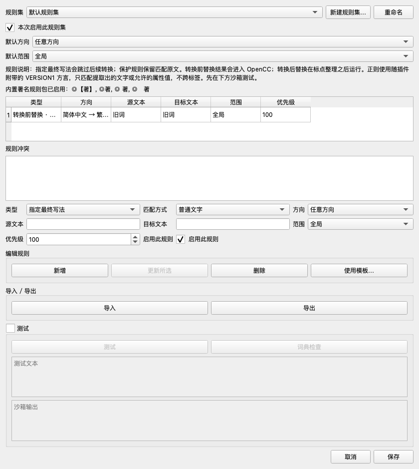

# UI、规则与正则审查：Luna 实现及验收规格

日期：2026-09-26。基线：`main`，`e5329e7ae7133b9466c043971edee73fd99be96d`，源码版本 `0.2.5`。

本轮审查集中在规则管理器、规则导入导出、分阶段替换、沙箱，以及它们与转换预览的衔接。已对照历史审查并检查当前实现；下列结论针对本次基线，不是把旧问题重新列一遍。本轮交付文档、复现脚本和截图，**没有修改产品实现**。

## 1. 给 Luna 的任务入口

可以直接把以下内容作为接手指令：

> 阅读本文件，按第 3 节顺序完成 R-01 至 R-12，再完成 U-01。每次只处理一个条目，先运行其复现，补入正式回归测试，再修改实现。每条必须满足“目标行为”和“验收”中的全部条件，不能只让附带脚本转绿。把执行结果写入同目录 `02-implementation-results.md`，保留实际命令、输出摘要和未完成原因。遇到与基线不同的行为，先核对当前代码和证据，不照抄行号修改。完成后执行第 6 节总验收。

### 执行约束

1. 开始前记录 `git status --short`、当前分支和 HEAD；保留接手时已有的修改。提交、推送按接手会话中的用户要求执行，本规格不包含发版任务。
2. 每条先确认问题，再把有区分力的用例加入 `tests/unit/` 或 `tests/integration/`。确认修复前失败、修复后通过。不可通过删除断言、加 `xfail`、捕获并吞掉异常来完成条目。
3. 新增文案同时加入 `resources/i18n/en.json`、`zh-Hans.json`、`zh-Hant.json`。正则原文、用户文字和异常技术详情不要求翻译，面向用户的解释必须翻译。
4. 普通 UI 状态测试沿用 `tests/support/fake_qt.py`；真实尺寸、显示/隐藏、键盘行为必须增加真实 Qt 验证。假 Qt 通过不能替代布局验收。
5. 不更换 OpenCC/regex 后端，不改官方字典，不取消正则时间与资源限制，不重写转换器，不扩展为整份 XHTML 正则替换。
6. 保留现有保护优先、同阶段不级联、原文坐标补丁、快照校验、预览后写回边界，以及 V1 规则兼容行为。
7. 每条运行定向测试和 Ruff；每批运行全套 pytest；最后运行 `make check`。只有出现新修改、失败或未解决疑点时才重复已完成的检查。
8. 附带复现放在 `docs/`，不在默认 `testpaths` 内。正式测试应迁入合理位置；文档脚本可以同步调整调用接口，但不得放宽目标行为，也不能只留文档脚本当回归保护。

## 2. 本次证据与结论

| 检查 | 实际结果 | 证明边界 |
| --- | --- | --- |
| 现有测试 | `569 passed, 1 skipped`，45.04 秒 | 现有测试基线；跳过的是规则窗口尺寸测试 |
| `mise exec -- ruff check .` | 通过 | Python 静态检查 |
| `tools/build_plugin.py --check` | 通过，版本 0.2.5 | 本地元数据与所需文件检查，不是已发布包验收 |
| `tools/verify_vendor.py` | 通过，macOS arm64，1 个 OpenCC payload | 当前检出的本地 payload |
| 本轮行为复现 | **16 个预期行为断言失败，覆盖 11 个条目** | R-01 至 R-10、R-12；失败正是待修问题 |
| 真实 Qt | PySide6 **6.11.2**，macOS，offscreen，三种界面语言 | R-11 的显示/尺寸证据；不是 Sigil 宿主验收 |

首次运行现有测试得到 `92 failed, 435 passed, 1 skipped, 42 errors`。已确认 OpenCC payload 根目录存在未跟踪的 `.DS_Store`，触发完整性校验失败；将该文件移到临时目录保留后，重新运行得到上述 569 通过。没有改 manifest 哈希或关闭完整性检查。接手时若再出现同类失败，先定位差异，不能把损坏环境记录为产品回归，也不能默认忽略所有隐藏文件。

复现入口（在仓库根目录执行）：

```sh
mise exec -- uv run python -m pytest docs/reviews/2026-09-26/scripts/test_review_regressions.py -q --tb=short
```

基线返回码为 1，结果为 `16 failed`。这是**期望正确行为的红测**，不是修复完成的验收结果。定向运行使用 `-k r01`、`-k r02` 等编号。

真实 Qt 原始数据：[layout.json](evidence/layout.json)。基线截图：

- [简体中文](evidence/rules-zh-Hans.png)
- [繁体中文](evidence/rules-zh-Hant.png)
- [英文](evidence/rules-en.png)



## 3. 执行顺序

下表中的文件路径均相对于仓库根目录。条目行号只用于定位本次基线。

| 批次 | 条目 | 优先级 | 内容 | 依赖 |
| --- | --- | --- | --- | --- |
| 1 | R-01 | P1 | 清空默认规则集必须保存到磁盘 | 无 |
| 1 | R-02 | P1 | 编辑规则保留归属、版本与备注 | 无 |
| 1 | R-03 | P1 | 导入去重覆盖 V2 语义 | 无 |
| 1 | R-04 | P2 | 导出不能无提示丢失正则与阶段信息 | R-03 的 JSON 往返测试 |
| 1 | R-05 | P1 | 预览分组限定到实际的一次规则命中 | 无 |
| 1 | R-10 | P1 | 最终写法也遵守输出预算 | 无 |
| 2 | R-06 | P2 | 沙箱使用明确、准确的生效规则集合 | R-01 |
| 2 | R-07 | P2 | 沙箱命中数与阶段展示准确 | R-06 |
| 2 | R-12 | P2 | JSON“跳过无效记录”真正逐条生效 | R-03 |
| 3 | R-08 | P2 | 草稿、更新、新增、保存的状态明确 | R-02 |
| 3 | R-09 | P2 | 空目标显示为删除 | 无 |
| 3 | R-11 | P2 | 真正折叠沙箱，窗口适配普通屏幕 | R-08、R-09 |
| 4 | U-01 | P3 | 规则列表可查找、可辨识、可核对生效范围 | 批次 1–3 |

每条应形成独立、可审查的修改；不要把后端修复、列表筛选和布局重排混成一个大提交。建议英文提交主题分别使用 `fix: ...`、`ui: ...`，文档与对应测试跟随该条。

## 4. 必须修复的条目

### R-01：清空默认规则集后，旧规则仍留在磁盘（P1，已复现）

**位置**：`plugin/OpenCCForSigil/app/settings.py`，`RunSettings.edit_rules()`，基线 327–330 行。

**复现**：已有 `default.json`，包含一条规则；在规则管理器删除最后一条规则并保存。`old != item and (item.id != "default" or item.rules)` 拦住了空默认集的写入。内存窗口显示已清空，但重新加载仍有旧规则，后续 `freeze_rules()` 继续使用它。

**目标行为与修改边界**：

1. 已存在的默认规则集发生任何变更时都保存，包括清空、禁用、修改默认方向/范围。
2. 可以保留“不为完全未修改的内置空默认集新建文件”的优化，但必须区分“从未落盘”和“已存在、现在变空”。
3. 复用 `RuleStore.save()` 的原子替换；不要通过移除规则集引用来伪装修复，也不要直接删除文件而丢失规则集元数据。

**验收**：

- `-k r01` 转绿。
- 在 `tests/integration/test_ruleset_persistence.py` 补“清空后重新打开管理器”“重新构造 RunSettings 后规则不复活”“清空且禁用后元数据保留”。
- 没有新增/修改的空默认集仍可不创建文件；其他规则集的保存行为保持正确。

### R-02：更新规则会重绑到当前书/方案，并丢失旧语义和备注（P1，已复现）

**位置**：`ui/rules_window.py`，`_rule_from_form()`、`_update_selected()`，基线 853–904 行；实际文件前缀为 `plugin/OpenCCForSigil/`。

**复现**：规则属于 `book-A`，`semantic_version=1`，带 `comment` 和 `source_note`。在 `book-B` 打开规则集，只修改目标词并“更新所选”。实际结果为 `book-B`、版本 2、备注和来源全部清空。`_rule_from_form()` 从当前窗口环境新建整条规则，更新时只恢复了 ID 和创建时间。

**目标行为与修改边界**：

1. 新建和更新分开处理；更新以旧 Rule 为基准，只覆盖用户实际编辑的字段。
2. 范围未变时保留 `profile_id` / `book_fingerprint`。明确把范围改为当前书/方案时，才绑定当前有效 owner；缺少 owner 时不能提交。
3. 只改文字/优先级/启用状态不能将 V1 自动升级。用户主动采用正则或前后替换等 V2 功能时才升级到 V2；不改变无关规则。
4. 保留 `id`、`created_at`、`comment`、`source_note`；真实修改时更新 `updated_at`。不要为了保持版本而丢掉新动作。
5. 选中其他书/方案所属的规则时显示“属于其他书籍/方案，本次不生效”等可理解的说明。不要把“当前书”标签误当作执行重绑定的按钮。

**验收**：

- `-k r02` 转绿；为 profile owner、混合 V1/V2 规则集、V2 切换回普通文字增加对称测试。
- 原样加载再更新不会改变归属和语义；显式切换 scope 的正反场景均验证。
- 用存在优先级竞争的 V1 规则做一次更新前后转换对比，证明保留版本有实际效果。

### R-03：JSON 导入把不同阶段/匹配方式的规则当成重复丢弃（P1，已复现）

**位置**：`rules/importers.py:36` 的 `rule_dedup_key()`；共享调用方 `ui/rules_window.py:review_import()`。

**复现**：源词和目标词相同，分别建立 pre / post 两条规则；JSON 导出再导入，只剩一条。literal / regex、启用 / 停用、replace / override 的组合也会被吞掉。本轮四个参数化场景全部失败。

**目标行为与修改边界**：

1. 语义去重键必须包含 `semantic_version`、`enabled`、`action`、`match_type`、`stage`，并保留原有方向、类型、源/目标、优先级和有效 owner。
2. ID、时间戳不应成为语义去重依据；真正相同的规则仍报告为重复。备注差异采用现有“保留已有条目”策略，在导入详情说明，不静默改写已有备注。
3. 导入器与“和当前规则列表比较”的 UI 必须使用同一个去重函数。保留 ID 冲突重新分配逻辑。

**验收**：

- `-k r03` 的四项转绿。
- 补 V1/V2 同字面字段、不同 owner、不同行为以及真正重复的矩阵。
- JSON 往返逐字段保留规则；`review_import(existing, imported)` 也验证同一矩阵。

### R-04：导出 CSV/TSV/TXT 会无提示地抹掉规则语义（P2，已复现）

**位置**：`rules/exporters.py`，`_export_warnings()`、`_delimited()`、TXT 分支；`ui/rules_window.py:_export()`。

**复现**：book 范围的 pre 正则规则 `旧.+ → 新词`，三种交换格式的 `export_warnings()` 都返回 `lossy=False`。实际输出只有旧式词条列，重新导入变成普通文字最终写法，阶段、归属等已丢失。

**本轮确定的产品行为**：

1. JSON 是完整规则交换格式，保留所有 Rule 字段。导出对话框明确标注其为推荐选项。
2. 本轮不设计新的 CSV schema。CSV/TSV 继续兼容旧词条格式；只要会丢失动作、匹配方式、阶段、版本语义、scope/owner、enabled、priority 等行为信息，导出前列明损失并允许取消，默认不确认。
3. OpenCC TXT 只输出可表示的启用普通文字最终写法词条。正则、保护、前后替换、空目标，以及无法安全编码为一行词条的 source/target，列为“不能表示、将跳过”，显示数量。可输出但丢失方向、范围等限制时仍须说明。
4. JSON 是规则条目导出，不宣称保存规则集启用状态/名称等集合元数据，除非另行明确实现。
5. 预警和实际导出共用选择/分类逻辑，防止提示的跳过数量与文件不一致。取消后不创建、不覆盖目的文件。

**验收**：

- `-k r04` 三项转绿。
- 逐项验证 V2 replace、regex、book/profile、disabled、protect、带空白或换行、空目标的导出结果与提示。
- TXT 结果每行都能按已声明方向读回；默认普通词条保持兼容；JSON 往返无字段丢失。

### R-05：一次接受会联动其他段落/文件中的独立替换（P1，已复现）

**位置**：`core/converter.py:_staged_segment_changes()`，基线 284–288 行；`core/planner.py:_absolute_change()`，339 行；`ui/preview_window.py:_decide_group()`。

**复现**：前置替换 `a123b → x123y`；两个文件各有两个 `<p>a123b</p>`。每次替换形成两个补丁，本应有四个独立决策组。当前全部获得 `rules:r@0`。调用预览实际使用的 `_decide_group()`，接受一次改动会接受 **8 条**，正确应为本次命中的 **2 条**。

**目标行为与修改边界**：

1. 同一次替换产生的多个补丁保持一个原子决策组；不同文件、文本 target、同 target 中被保护片段隔开的独立 segment 必须区分。
2. converter 内的局部分组应包含 segment 的原文偏移；planner 将规则局部分组限定到 `file_id + target.node_id`。使用确定性编码/哈希，避免简单拼接的分隔符碰撞。
3. 只限定 `rules:` 规则分组。保留本来就需要跨文件联动的 `language_metadata` 分组。
4. 分组应根据依赖关系生成，不能把所有 group_id 清空，也不能简单改成“每条 patch 一个组”。

**验收**：

- `-k r05` 转绿：第一份文件只接受 2 条，第二份文件接受 0 条。
- 增加同文件不同段落、同 target 两个未锁定 segment、同一次命中多补丁、前后替换产生依赖的场景。
- “接受此条”“跳过此条”“当前文件”“当前筛选”均不联动独立出现；原有语言元数据联动测试继续通过。
- 经过 preview → stage → verify 的输出只改变选中的一次完整替换。

### R-06：沙箱没有按启用状态与当前规则组合工作（P2，已复现）

**位置**：`ui/rules_window.py:_test()`、`_inspect()`；`app/settings.py:edit_rules()`、`freeze_rules()`。

**复现**：规则集取消“本次启用此规则集”，测试 `旧词`，沙箱仍输出 `新词`。它直接使用 `self.rules`，没有读取集合级 enabled，也没有组合当前运行引用的其他规则集。实际转换会跳过禁用集合。

**本轮确定的产品行为**：

1. 沙箱增加明确的测试范围：“当前规则集”和“本次转换”。默认“当前规则集”，始终显示当前配置、scope 上下文与被测集合。
2. 两种模式均遵守规则集和规则的 enabled、方向及 owner；禁用集合提示“不参与本次测试”。不靠偷偷重新启用来帮助测试。
3. “本次转换”使用当前运行引用的集合 ID，加上管理器中对应的未保存集合草稿，组合方式与实际 `freeze_rules()` 一致。向管理器显式传入这组 ID，不能把磁盘上所有集合视为启用。
4. 新建但尚未纳入本次转换的集合可在“当前规则集”模式单独测试，并显示“尚未加入本次转换”；不能把这个结果标记为整次转换结果。
5. `_inspect()` 和 `_test()` 共享被测快照构造。内置规则开关、quotation、punctuation、pivot 继续走同一转换管线。

**验收**：

- `-k r06` 转绿；默认单集合模式不能运行禁用集合。
- 两个启用集合组合生效、一个禁用、另一个方向、其他书/方案、尚未引用的新集合均有测试。
- 使用同一原文、配置和被测规则快照，对比沙箱 final 与 planner 的文本结果；带标签输入仍明确是文本沙箱，不宣称 XHTML 预览等价。
- 使用 fake backend 验证开关，再使用真实 OpenCC 做至少一组 pre → OpenCC → post 的集成测试。

### R-07：沙箱把最终写法命中重复计数，阶段记录不准确（P2，已复现）

**位置**：`ui/rules_window.py:_test()`、`inspect_dictionary()`；必要时涉及 `core/converter.py` 和转换结果的数据契约。

**复现**：一条最终写法 `旧词 → 新词` 命中一次，沙箱显示 `Hits: 2`，同一明细重复两遍。它把 `lock_spans()` 的命中和所有 `UserRule:` 变更再次相加。前后替换则从最终 diff 反推命中：零净变更会消失，多补丁可能多算，多规则 ID 还会拼成一个字符串。

**目标行为与修改边界**：

1. 区分“实际采用的规则命中次数”和“最终补丁数”。不要把 patch 当 hit；被冲突/保护优先级淘汰的候选不算已采用命中。
2. 在真实执行时产生可选的结构化 trace，记录规则 ID、动作、阶段、该阶段输入坐标、匹配原文、替换结果。不能为了说明再跑一遍全部正则。
3. 沙箱显示：原文、源阶段锁定明细、前置替换后、OpenCC/标点处理后、后置替换后最终文本。保留锁定片段，不能为了生成阶段文本把锁定原文交给 OpenCC。
4. trace 是内存中的沙箱说明；默认书籍分析不保留整本文字副本，不把原文/命中内容写入历史或日志。不暴露为“OpenCC 内部字典命中追踪”。
5. 没有实际变化但成功匹配的规则，可显示“命中但最终无变化”；没有匹配才显示“未命中”。

**验收**：

- `-k r07` 转绿，一次最终写法只显示一条命中。
- 保护、override、pre、post 各一个最小场景；另外覆盖一次命中多补丁、两条规则合并到一条补丁、替换后被 OpenCC 还原、target 等于 source。
- trace 开/关时最终输出、补丁、决策分组完全相同；通过 spy 确认没有为展示重复执行正则/转换。

### R-08：未提交表单草稿会丢失，新增与更新缺少明确状态（P2，已复现）

**位置**：`ui/rules_window.py`，`_guard_reject()`、`_ruleset_changed()`、`_load_selected()`、`_submit_editor()`、`_fill_template()`、`_apply()`。

**复现**：只在源/目标输入框输入内容，不点“新增”；此时关闭窗口，`_guard_reject()` 返回 True，不询问丢弃。直接“保存”也只保存规则列表，表单草稿不进入结果。当前更新模式依赖 table.currentRow，模板填入后按 Enter 也可能更新原来选中的规则。

**本轮确定的交互**：

1. 显式维护 `editing_rule_id` 和 editor dirty 状态；新增模式不依赖是否恰好选中某一行。显示“新增规则”或“编辑所选规则”。
2. 保存规则集时，若存在合法表单草稿，先新增/更新该草稿，再保存；无效草稿留在原处并指出字段错误，不能关闭窗口。
3. 切行、切集合、新建、填模板前，如会覆盖未提交草稿，给“应用草稿 / 放弃草稿 / 返回编辑”三种选择；操作取消不能改变原选择。
4. 关闭/Esc 对表单草稿和集合草稿统一检查。初始化、程序化加载表单不得误报 dirty；保存成功后清零。
5. 模板填充进入新增模式，保留选定方向/范围，绝不自动覆盖旧规则。Enter 的动作由编辑模式确定；新增后清空或切换到明确的编辑状态，避免连续 Enter 创建重复项。
6. 测试使用的规则以已应用到列表的草稿为准；如表单尚未应用，在测试入口先处理草稿，不让旧规则结果冒充新输入的测试结果。

**验收**：

- `-k r08` 转绿；还需真实 Qt 键盘操作验证，不能只检查某个布尔变量。
- 新增/编辑两种模式分别测试：输入 → 保存、输入 → Esc、切换行/集合 → 返回编辑、模板 → Enter。
- 无效正则不能被“保存”绕过；选择“返回编辑”不丢字、不切换规则、不改 owner。
- 所有删除/更新动作保持稳定 ID，不以重排后的行号认领另一条规则。

### R-09：删除规则在表格中被显示成“原文 → 原文”（P2，已复现）

**位置**：`ui/rules_window.py:_refresh()`，基线 823 行；相同显示逻辑还见 `rules/conflicts.py:RuleConflict.message`。

**复现**：replace 规则 `旧词 → ""`，目标列实际显示 `旧词`，来自 `rule.target or rule.source`。这会把实际删除行为伪装成没有变化或保护规则。

**目标行为**：

1. 仅 protect 可以显示匹配原文；override/replace 的空字符串是合法删除，目标列显示本地化的“（删除匹配文本）”。
2. 值仍保留 `""`，加载表单、导出和执行不能把显示占位文字当成真正的 target。
3. 冲突详情、沙箱命中、导出预览等位置也区分空目标和保护动作。纯空白目标通过提示明确数量/种类，不能看起来等于空目标。

**验收**：

- `-k r09` 转绿；测试 protect 与空 override、pre/post 删除的不同显示。
- 表单 → 列表 → 保存 → 重新加载 → JSON 导出 → 转换，全程 target 仍为原值。

### R-10：正则最终写法绕过替换输出预算（P1，已复现）

**位置**：`rules/matching.py:collect_matches()`、`RegexBudget.note_output()`、`source_matches()`；`core/converter.py:_convert_rules()`。

**复现**：把输出预算临时设为 4，正则最终写法 `x → 12345`，转换直接成功，没有触发限制。当前只有 `replace_stage()` 记录输出，源阶段 override 路径直接追加 `span.target`。此外 `collect_matches()` 在选择之前为每个候选生成 target，不能只在最终拼接时防护。

**目标行为与修改边界**：

1. 所有会产生替换输出的动作统一遵守本次分析的累计输出预算，含 source override、pre、post。保持默认上限，不扩大限额掩盖问题。
2. 对过大的单次展开和候选累积尽早失败，不能先积攒大量展开字符串再核对上限。保护原文本身不算新生成替换输出。
3. 清楚区分候选内存上限与实际输出预算，避免 source/pre/post 同一段重复记账。计数跨文件和文本 target 累加，一次新的分析重新开始。
4. 错误包含规则 ID、阶段、位置及违反的限制；UI 提供可理解摘要，原文不进入日志。越限终止整次分析，不留下可写回的半个计划。

**验收**：

- `-k r10` 转绿，用小预算测试，不在测试中申请巨量内存。
- 覆盖 source/pre/post、literal/regex、单次超额、跨片段累计超额、恰好上限、protect 不误占输出、全新分析重置。
- 在 controller/workflow 层使用 spy 确认越限时没有任何 BookContainer 写入，也没有显示可应用的部分预览。

### R-11：沙箱没有真正折叠，规则窗口高出常见屏幕（P2，真实 Qt 已复现）

**位置**：`ui/rules_window.py:_build()` 的纵向布局、test_box；`tests/unit/test_rules_window.py:test_rules_window_minimum_height_fits_common_screen`。

**实测**：

| 语言 | 最小宽×高 | 初始宽×高 | 未勾选时沙箱输入可见 | 规则表高度 |
| --- | --- | --- | --- | --- |
| en | 979×925 | 979×925 | True，仅被禁用 | 90 |
| zh-Hans | 582×939 | 840×939 | True，仅被禁用 | 90 |
| zh-Hant | 594×939 | 840×939 | True，仅被禁用 | 90 |

QGroupBox 的 checkable/unchecked 在当前实现中只是禁用子项，没有隐藏布局。大块空冲突区、关闭的沙箱、常驻长说明同时挤压规则列表。现有假 Qt 尺寸测试直接 skip，因此没有发现问题。

**本轮布局要求**：

1. 保留单窗口，使用独立的沙箱内容容器；折叠时隐藏该容器，展开恢复。保留 `test_box`/`test_input` 等逻辑入口，便于回归检查。
2. 没有冲突时不显示空白冲突列表；有冲突才显示有界高度的列表和计数。
3. 规则表获得主要可伸缩空间。默认方向/范围、priority、详细说明放入次级区域；保留当前集合启用状态和主要动作可见。
4. 设置内容必要时可以滚动；底部“取消 / 保存规则集”始终固定可达。不得靠整体缩小字体或给所有控件固定微小高度解决。
5. 初始窗口适配可用屏幕，恢复旧窗口尺寸也需限制到当前屏幕。展开沙箱可使用滚动/分隔容器，不能把窗口再次强迫到屏幕外。
6. 顺手去掉双重“启用此规则”标签；测试区域的开关表达“展开测试”，与规则启用勾选语义区分。

**真实 Qt 自动验收**：

```sh
QT_QPA_PLATFORM=offscreen PYTHONPATH=plugin/OpenCCForSigil mise exec -- \
  uv run --with PySide6==6.11.2 python \
  docs/reviews/2026-09-26/scripts/check_rules_layout.py \
  --output /tmp/opencc-rules-layout-after --verify
```

三种语言均要求最小高度 `<600`、最小宽度 `<=1000`、初始高度 `<=720`、折叠输入不可见、展开输入可见、初始表格高度 `>=150`。该命令使用 uv 临时依赖环境，不修改项目依赖/lockfile。基线应失败。

**人工/宿主验收**：另检查 1280×800、系统缩放、长中文/英文文本及默认键盘顺序；保存按钮必须可达。offscreen 只证明本机 Qt 布局，真实 Sigil 的主题、宿主缩放与键盘行为仍需记录具体版本后实测。

### R-12：JSON 导入勾选“跳过无效记录”仍整批失败（P2，已复现）

**位置**：`rules/importers.py:_json_rules()`、`import_rules()`；`ui/rules_window.py:_import_options()`。

**复现**：JSON 数组含“有效条目、带未知字段的条目、有效条目”，使用 `strict=False`，仍直接抛 `ValueError: unknown rule fields`。JSON 在返回给逐条验证循环之前已用列表推导创建 Rule，错误绕开 diagnostics 路径。

**目标行为**：

1. 整份 JSON 的语法错误、根结构错误仍整体失败；结构正确的数组逐条创建并验证 Rule。
2. `strict=False`：保留有效项，为每个无效项提供记录序号/原因；`strict=True`：首个无效项终止，无内存或磁盘部分变更。
3. 明确区分 JSON 的“第 N 条记录”和 CSV/TSV/TXT 的文件行号，不能把解析后的列表索引伪称为原始物理行。
4. 导入预览先展示有效数、错误数、去重和冲突，再由用户确认添加；跳过错误不等于忽略冲突。保持导入后的内容在保存前可撤回。

**验收**：

- `-k r12` 转绿。
- 覆盖未知字段、非对象记录、缺 direction、无效正则、缺 owner、整体 JSON 损坏；验证 strict 两种模式。
- 检查首尾有效项顺序、错误记录序号，以及“取消导入”不改变列表和磁盘。

## 5. UI 优化条目

### U-01：让规则列表可查找，并明确本次是否生效（P3，体验改进）

这项是基于当前 UI 的改进要求，不计入上面 12 项已复现缺陷。当前表格只有六列，类型/方向易截断；规则多时没有搜索，global/profile/book 标签无法说明当前上下文是否命中。

**限定范围**：在 R-08 的稳定 ID 状态管理和 R-11 的布局上增量实现，不替换成新的通用表格框架。

1. 增加一个普通文字搜索框，搜索 source、target、comment 和 rule ID；搜索框不执行用户输入的正则。
2. 增加“全部 / 本次生效 / 本次不生效”的单个筛选。判定复用运行时 `applies_to()`，再考虑集合 enabled 与本次引用状态，不复制另一套优先级逻辑。
3. 选中规则时展示动作、匹配方式、方向、归属、生效/不生效原因。长 source/target 可复制查看全文；不要只留下省略号。
4. 将类型/匹配方式、源/目标列配置合理宽度/伸缩策略，不在每次输入/选择时全表 `resizeColumnsToContents()`。
5. 显示“当前显示 N 条 / 总计 M 条”。筛选只改变显示，不能删规则、改变顺序语义、丢草稿或错误更新隐藏行。

**验收**：

- 500 条合成规则进行搜索、选中、更新、清除筛选，按 ID 断言只改目标规则，其他记录完全相同。
- 启用状态、方向、profile/book owner 的筛选结果与实际 snapshot/`applies_to()` 对照一致。
- 编辑中的规则被筛掉时遵守 R-08 的草稿处理，不无声覆盖；真实 Qt 中长正则可复制完整内容。
- 不设脆弱的绝对耗时测试；确认搜索不会运行 OpenCC/regex、不会每次重编译所有规则，输入时无明显卡顿。

## 6. 总验收与完成定义

### 6.1 自动检查

```sh
# 本轮所有行为复现必须转绿；迁入正式测试后仍可保留此入口。
mise exec -- uv run python -m pytest docs/reviews/2026-09-26/scripts/test_review_regressions.py -q

# 本轮真实 Qt 布局检查，不能用 fake Qt skip 替代。
QT_QPA_PLATFORM=offscreen PYTHONPATH=plugin/OpenCCForSigil mise exec -- \
  uv run --with PySide6==6.11.2 python \
  docs/reviews/2026-09-26/scripts/check_rules_layout.py \
  --output /tmp/opencc-rules-layout-after --verify

# 完整仓库检查，含 Ruff、pytest、vendor、OpenCC/Jieba 差分、构建检查。
make check
```

单条优先执行对应 `-k rNN` 和新增的正式定向测试；修改 i18n 时运行 `tests/unit/test_i18n.py`。不要将“16 个复现转绿”当作全部完成：每条验收中的补充边界也必须进入正式测试或人工记录。

### 6.2 真实 Sigil 最小操作表

使用合成 EPUB；不要以真实书稿正文充当日志或提交夹具。

| 流程 | 必须看到的结果 |
| --- | --- |
| 打开规则管理器，简/繁/英文各一次 | 常规屏幕内可操作；关闭的沙箱不占大块空间 |
| 添加普通文字、正则、保护、前后替换 | 动作与测试结果一致；错误定位到字段 |
| 输入草稿直接保存；输入后切集合再返回 | 合法草稿保存；返回编辑完整保留输入 |
| 默认集合删除全部后保存并重开插件 | 旧规则不复活 |
| 禁用集合并测试，随后运行分析 | 测试范围清楚，禁用规则不参与 |
| 两文件各两段相同规则，接受一次出现 | 只接受一次完整替换；其他出现仍未决定 |
| JSON 往返，CSV/TXT 导出有损规则 | JSON 不丢字段；有损格式先说明损失或跳过 |
| 最终写回、保存 EPUB、重新打开 | 只存在已接受的修改，结构与未选文件保持原状 |

记录 OS、Sigil 版本、Qt 绑定/版本、实际加载的插件 ZIP SHA-256、测试 EPUB SHA-256、各步骤结果。若手动验收条件不足，结果表必须写 `Not verified`，并区分“实现和本地自动验证完成”与“宿主验收完成”；不得用 offscreen 截图或本地构建通过代替真实宿主结论。

### 6.3 Luna 交付表

在 `02-implementation-results.md` 使用以下格式，每条一行，补齐证据路径：

| 条目 | 修复前证据 | 实现/提交 | 正式测试 | 复现转绿 | 真实 Qt/Sigil | 状态 |
| --- | --- | --- | --- | --- | --- | --- |
| R-01 | 基线 r01 失败 | 待填 | 待填 | 待填 | 待填或不适用 | 待执行 |

总结果要写明：实际通过/失败/跳过数量、`make check` 结果、三语言布局截图位置、宿主未验证项。**未修复、未验证、条件不具备是三种不同状态。** 本轮不包含版本升级、发布 ZIP 或修改发布流水线。
